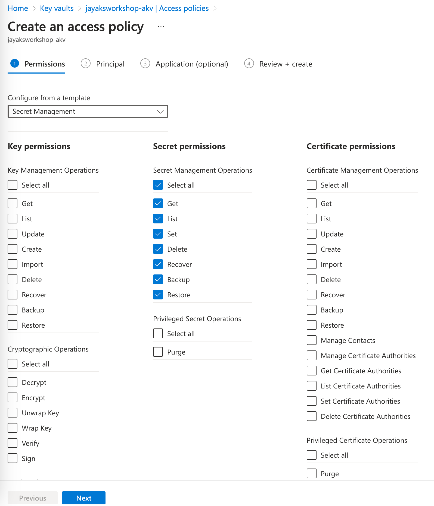
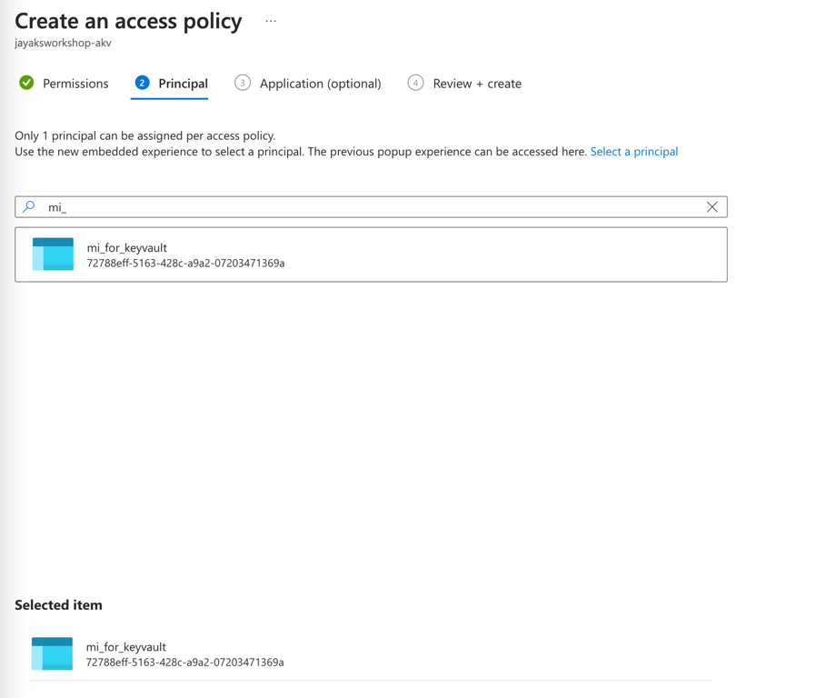

# Deploy App

Since AKS cluster is ready, we will deploy a sample application to the AKS cluster to test the functionality of the cluster. 

## Sample App - ACME Fitness Shop

ACME Fitness store is a fictional online retailer selling sporting goods. Full application is composed of 7 microservices, but for the purpose of this lab, we will deploy only 2 services, the frontend and the catalog service. The frontend service is a web application that serves the user interface and the catalog service is a backend service that provides the product catalog. Frontend is written in Node.js and the catalog service is written in Java.

## Container Development

Before we get into setting up the application, let's have a quick discussion on what container development looks like for the customer. No development environment is the same as it is not one size fits all when it comes to doing development. Computers, OS, languages, and IDEs to name a few things are hardly ever the same configuration/setup. And if you throw the developer themselves in that mix it is definitely not the same.

As a result, different users work in different ways. The following are just a few of the **inner DevOps loop** tools that we are seeing in this ecosystem, feel free to try any of them out and let us know what you think. And if it hits the mark.

### Tilt

Tilt is a CLI tool used for local continuous development of microservice applications. Tilt watches your files for edits with tilt-up, and then automatically builds, pushes, and deploys any changes to bring your environment up-to-date in real-time. Tilt provides visibility into your microservices with a command-line UI. In addition to monitoring deployment success, the UI also shows logs and other helpful information about your deployments.

Click [here](https://github.com/windmilleng/tilt) for more details and to try it out.

### Telepresence

Telepresence is an open-source tool that lets you run a single service locally, while connecting that service to a remote Kubernetes cluster. This lets developers working on microservices to:

1. Do fast local development of a single service, even if that service depends on other services in your cluster. Make a change to your service, save, and you can immediately see the new service in action.
2. Use any tool installed locally to test/debug/edit your service. For example, you can use a debugger or IDE!
3. Make your local development machine operate as if it's part of your Kubernetes cluster. If you've got an application on your machine that you want to run against a service in the cluster -- it's easy to do.

Click [here](https://www.telepresence.io/reference/install) for more details and to try it out.

## Push Images to Azure Container Registry (ACR)

This section grabs the container images from Docker Hub and then pushes them to the Azure Container Registry that was created.

```bash
# Pull Images from Docker Hub to Local Workstation
docker pull eggboy/acme-frontend:1.0.0
docker pull eggboy/acme-catalog:1.0.0

# Authenticate to ACR
az acr list -o table
az acr login -n ${PREFIX}acr

# Push Images to ACR
docker tag eggboy/acme-frontend:1.0.0 ${PREFIX}acr.azurecr.io/acme-frontend:1.0.0
docker tag eggboy/acme-catalog:1.0.0 ${PREFIX}acr.azurecr.io/acme-catalog:1.0.0
docker push ${PREFIX}acr.azurecr.io/acme-frontend:1.0.0
docker push ${PREFIX}acr.azurecr.io/acme-catalog:1.0.0
```

## Deploy Application

There is an app.yaml file in this directory so either change into this directory or copy the contents of the file to a filename of your choice. Once you have completed the previous step, apply the manifest file, and you will get the web and worker services deployed into the **dev** namespace.

**NOTE**: Before you apply the manifest file, make sure to update the `app.yml` file with the correct ACR name.

```bash
# Deploy the Postgres Database
kubectl apply -f postgres.yml

# Deploy the Application Resources
kubectl apply -f app.yml

# Display the Application Resources
kubectl get deploy,rs,po,svc,ingress -n dev
```
- Test with the Application Gateway Public IP

```bash
az network public-ip show -g $RG -n $AGPUBLICIP_NAME --query "ipAddress" -o tsv
```
Open the browser and head to the IP address of the Application Gateway to see the application running.


## Adding in Secrets Mgmt

In the previous section, we deployed the frontend(acme-frontend) and backend(acme-catalog) services to the AKS cluster. The backend service is using Postgres as a backend database which we deployed earlier. If you open the `app.yml` file, you will see that we are supplying Postgres connection details as environment variables as POSTGRES-SERVER-NAME, CATALOG-DATABASE-NAME, POSTGRES-LOGIN-NAME, and POSTGRES-LOGIN-PASSWORD. This is not a good practice as we are exposing the database connection details in the manifest file. We will now move these secrets to Azure Key Vault and use them in the application.

Here is a list of steps in a nutshell:

- Move DB Connection information from environment variable to Azure Key Vault (AKV).
- Configure Managed Identity to access Key Vault without any credentials
- Configure Microsoft Entra Workload ID with AKS.

### Create Azure Key Vault (AKV) & Secrets

- In this section, we will create the secrets backing store which will be Azure Key Vault and populate it with the secrets information.

```bash
# Create Azure Key Vault Instance
az keyvault create -g $RG -n ${PREFIX}-akv -l $LOCATION --enabled-for-template-deployment true
# Populate AKV Secrets
az keyvault secret set --vault-name ${PREFIX}-akv --name "POSTGRES-SERVER-NAME" --value postgres
az keyvault secret set --vault-name ${PREFIX}-akv --name "CATALOG-DATABASE-NAME" --value catalog
az keyvault secret set --vault-name ${PREFIX}-akv --name "POSTGRES-LOGIN-NAME" --value postgres
az keyvault secret set --vault-name ${PREFIX}-akv --name "POSTGRES-LOGIN-PASSWORD" --value catalog_user

```

### Configure AKS Workload identity with Entra ID Managed Identity

AKS Workload Identity requires the initial setup of enabling workload identity and OIDC Issuer for the AKS cluster, however these are all done as part of the AKS Terraform deployment in Day 1. so we will skip that part and move to the next step. Next step is to create the Azure Entra ID Managed Identity and permissions to AKV.

```bash
# Configure workload identity
az identity create --name "mi_for_keyvault" --resource-group $RG

# Make a note of this Client ID as it will be used in the next step
az identity show -g $RG --name "mi_for_keyvault" --query 'clientId' -o tsv

# Get the AKS cluster OIDC Issuer URL using the az aks show command.
az aks show --resource-group $RG --name $PREFIX-aks --query "oidcIssuerProfile.issuerUrl" -o tsv

# Establish a federated identity credential between the Microsoft Entra application, service account issuer, and subject.
# Open the identity-sa.yml file and replace the annotations with the Client Id from the previous step.
kubectl apply -f identity-sa.yml

# Create the federated identity credential between the managed identity, service account issuer, and subject 
export FEDERATED_IDENTITY_NAME="aksfederatedidentity" # can be changed as needed

az identity federated-credential create --name aksfederatedidentity --identity-name "mi_for_keyvault" --resource-group $RG --issuer $(az aks show --resource-group $RG --name $PREFIX-aks --query "oidcIssuerProfile.issuerUrl" -o tsv) --subject system:serviceaccount:dev:workload-identity-sa

```

### Key Vault Access Policy and Workload Identity setup for Pod

Managed Identity we created before is not given any permissions to access the Key Vault. We will now give the Managed Identity access to the Key Vault. Go to Azure portal and navigate to the Key Vault and add the Managed Identity to the Access Policy.




Once the Managed Identity has been given access to the Key Vault, we will now update the application manifest file to use the secrets from the Key Vault. You can see the updated manifest file [here](catalog-kv.yml). We will delete the existing deployment and apply the new manifest file.

```bash

kubectl delete deploy acme-catalog -n dev
kubectl apply -f catalog-kv.yml

```

Open the catalog-kv.yml file and see how we are using the secrets from the Key Vault. All the previous environment variables are removed, and Key Vault related environment variables are added. With Managed Identity, we don't use any credentials to access the Key Vault, so we can safely access the secrets from the Key Vault.

- Once the pods are up and running, check via the WAF Ingress Point

```bash
# Get Public IP Address of Azure App Gateway
az network public-ip show -g $RG -n $AGPUBLICIP_NAME --query "ipAddress" -o tsv
```

## Next Steps

[Cluster Security](/cluster-security/README.md)

## Key Links

- [Tilt](https://github.com/windmilleng/tilt)
- [Telepresence](https://telepresence.io)
